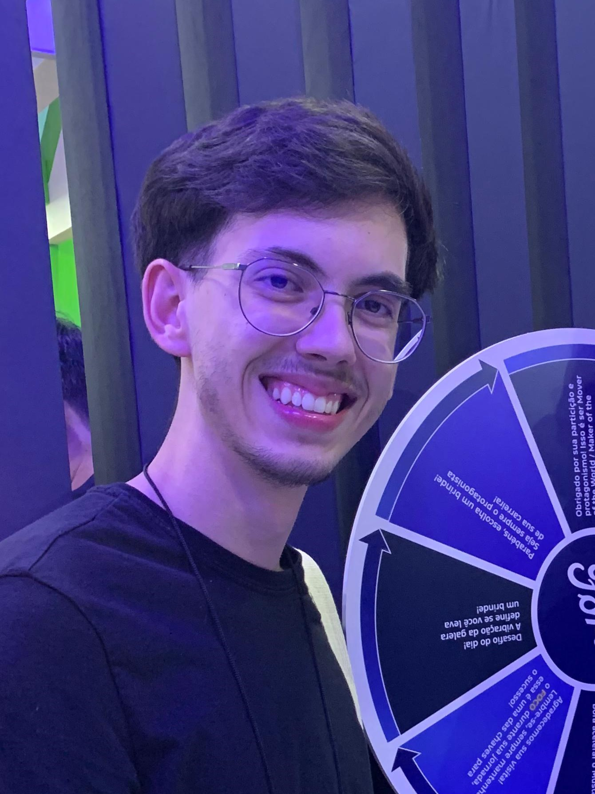

# Hacking Paris - Chiliz Hackathon

Figure 1 - Logo

Source: Material produced by the authors (2025)

# trbe

[**Website**]()

[**Slides**]()

[**Demo video**]()

# Table of Contents
- [1. Introduction](#1-introduction)
- [2. Problem](#2-problem)
- [3. Solution](#3-solution)
  - [3.1 Personas](#32-personas)
  - [3. Value Proposition Canvas](#33-value-proposition-canvas)
- [4. Technologies](#4-technologies)
  - [4.1. What makes it unique](#41-what-makes-it-unique)
  - [4.2. Tech Stack](#42-tech-stack)
- [5. Demo](#5-demo)
- [6. Market and Business Model](#6-market-and-business-model)
- [7. Benchmark and Competitive Analysis](#7-benchmark-and-competitive-analysis)
- [8. Future Plans](#8-future-plans)
- [9. Installation Guide](#9-installation-guide)
  - [9.1. Prerequisites](#91-prerequisites)
  - [9.2. Clone the Repository](#92-clone-the-repository)
  - [9.3. Additional Steps](#93-additional-steps)
  - [9.4. Troubleshooting](#94-troubleshooting)
  - [9.5. Additional Resources](#95-additional-resources)
- [10. FAQ](#10-faq)
- [11. Team](#11-team)

# 1. Introduction

# 2. Problem

# 3. Solution

### 3.1 Personas

### 3.2 Value Proposition Canvas

Figure 3 - Value Proposition Canvas

Source: Material produced by the authors (2025) | [View on Canva](https://www.canva.com/design/DAGgQwCzBa8/VKkLRE0mFBOaia_rLVcaKw/edit?utm_content=DAGgQwCzBa8&utm_campaign=designshare&utm_medium=link2&utm_source=sharebutton) | Template from [Strategyzer.](https://www.google.com/url?sa=i\&url=https%3A%2F%2Fwww.strategyzer.com%2Flibrary%2Fthe-value-proposition-canvas\&psig=AOvVaw1mu8QB2T4G5ERnVzEeuh9Y\&ust=1738958698227000\&source=images\&cd=vfe\&opi=89978449\&ved=0CBQQjRxqFwoTCIDyvo3sr4sDFQAAAAAdAAAAABAE)

## 4. Technologies

## 5. Demo

****Chiliz Spicy Testnet****

****FanClub Contract****: 0x82fbDD75F982cd2D8BeAcf73CA1980286e64Ed8f
 
****ScoreUser Contract****: 0xF4Bf9ac700b4f394181D6dFe5a40fB2f229B1fB2

## 6. Market and Business Model

## 7. Benchmark and Competitive Analysis

## 8. Future Plans

## 9. Installation Guide

## 10. FAQ

### Support

If you have any questions or dificulties feel free to send an email to davi.silveira@sou.inteli.edu.br

## 11. Team

|  |  |  |
| :---------------------------------------------------------------------------------------: | :--------------------------------------------------------------------------------: | :--------------------------------------------------------------------------------: |
|         [**Victor Garcia**](https://www.linkedin.com/in/victor-garcia-dos-santos/)        |         [**Kethlen Martins**](https://www.linkedin.com/in/kethlenmartins/)         |        [**Davi Abreu**](https://www.linkedin.com/in/davi-abreu-da-silveira/)       |
